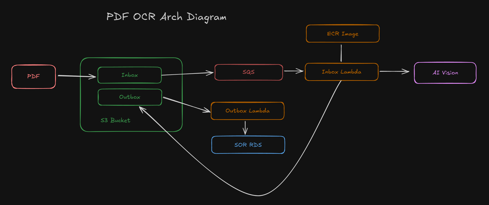

# AI Vision Contract OCR (Azure Version)

## Overview


This project is fully deployed on Azure and can use Azure OpenAI, OpenAI, or Anthropic vision models to perform OCR on PDF documents uploaded to Azure Blob Storage containers.  
Results are stored as markdown files in Azure Blob Storage for further processing and storage in a database.  

> **Note:** This project has been fully migrated from AWS to Azure and uses Azure native services for all infrastructure components.

## Pricing and Metrics for AI portion of the project using Azure OpenAI
* Vision GPT-4 input: $0.01/1K, output: $0.03/1K
* It takes roughly 1.5 minutes to OCR a 12-page document. Currently, the project is setup for processing 1 document at a time.
* Vision OCR averages per page: InputTokens:1633  OutputTokens:1095  Latency:33278ms Cost: $0.05 x12 = $0.60
* Extracting terms and conditions from the resulting text averages: InputTokens:12555  OutputTokens:520 Latency:16808ms Cost: $0.14
* Total cost per document: $0.74
* Total cost per month assuming 4k 12 page documents per month: $2,960

## Pricing for infrastructure
* Storage and data transfer less than $5/mo
* Azure Functions assuming 4k 12 page documents per month $50/mo
* Application Insights $10/mo
* Total cost per month assuming 4k 12 page documents per month: $65/mo

## Total cost per month assuming 4k 12 page documents per month: $65 + $2,960 = $3,025

## Prerequisites for Azure deployment
* If using Azure AI resources, they must be created and accessible
* The following resources are created automatically:
  * Azure Storage Account for storing PDFs and results
  * Azure Function App for processing
  * Azure Container Registry for Docker images
  * Azure Application Insights for monitoring

## Prerequisites for Azure OpenAI and other providers
* Set the environment variable for your chosen provider (AZURE_OPENAI_API_KEY, OPENAI_API_KEY, or ANTHROPIC_API_KEY)
* For local development or testing you can create a .env file in the repo root with needed API Keys.
* Example .env file
```bash
# If using Azure service principal login
export ARM_CLIENT_ID="<your info>"
export ARM_CLIENT_SECRET="<your info>"
export ARM_TENANT_ID="<your info>"
export ARM_SUBSCRIPTION_ID="<your info>"

# Azure Storage configuration
AZURE_STORAGE_CONNECTION_STRING=your_storage_connection_string
AZURE_SERVICEBUS_CONNECTION_STRING=your_servicebus_connection_string

# AI Provider credentials (choose one based on your preferred provider)
AZURE_OPENAI_API_KEY=your_api_key
OPENAI_API_KEY=your_api_key
ANTHROPIC_API_KEY=your_api_key

# Tracing (optional)
LANGCHAIN_TRACING_V2=false
LANGCHAIN_ENDPOINT=https://api.smith.langchain.com
LANGCHAIN_API_KEY=your_api_key
LANGCHAIN_PROJECT=pdf_ingestion
```

## Azure Architecture

This project uses the following Azure services:

* **Azure Blob Storage**: Stores PDFs in the input container and OCR results in the output container
* **Azure Queue Storage**: Triggers processing when new files are uploaded to the input container
* **Azure Functions**: Processes the PDFs using the AI vision models
  * **Inbox Container**: Docker-based function that processes PDFs and extracts text using AI vision models
  * **Outbox Function**: Responds to new files in the output container for any post-processing
* **Azure Container Registry**: Stores the Docker image for the Inbox Container function
* **Azure Application Insights**: Monitors the performance and health of the functions

### Process Flow

The processing flow is visualized in this [process flow diagram](process-flow.md):

1. PDF is uploaded to the Azure Blob Storage "inbox" container
2. A message is added to the Azure Queue Storage
3. The Queue-triggered Azure Function processes the PDF using AI vision models
4. Results are stored in the Azure Blob Storage "outbox" container
5. The Blob-triggered "outbox" function can perform additional processing on the results

## Deploying the project
* For local development or testing you can create a .env file in the repo root with needed API Keys.
* From the repo root run:
```bash
make all
```

## Testing
* Run the following command to test the project:
```bash
make azure-upload-pdf
make azure-list-outbox
```
The storage listing should show a folder with the name of the request id.  
If you then list that folder you should see the pages of the pdf in image and markdown format.  
There will be a file with a suffix of "-final.md" this is the final output of the pdf.  

## Configuration

### AI Providers
You can select the AI provider you want by setting AI_PROVIDER in the envs.azure.makefile.  
Available providers are AzureOpenAI, OpenAI and Anthropic.  
You can also select the desired model by setting AI_MODEL in the envs.azure.makefile. If you do not select one a default vision model will be used.

### Azure Configuration
The Terraform configuration in the `iac/` directory defines all Azure resources required for this project:

* Storage Account settings are defined in `iac/blob.tf`
* Azure Functions configuration is in `iac/functions.tf`
* Application Insights monitoring is set up in `iac/monitoring.tf`

You can customize the Azure deployment by modifying the variables in `iac/variables.tf`.

### Infrastructure as Code
The project includes full Infrastructure as Code (IaC) capabilities using Terraform. See `readme-iac.md` for detailed information about the infrastructure deployment.
