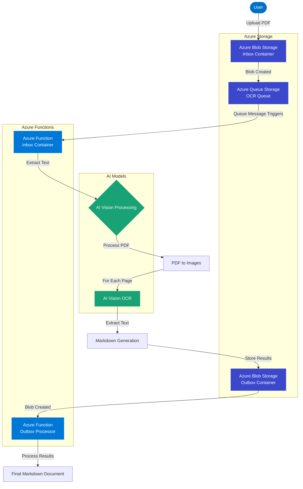

# PDF Ingest Process Flow

The diagram illustrates the PDF processing flow through the Azure-based architecture:

1. User uploads a PDF document to the Azure Blob Storage inbox container
2. A message is generated in the Azure Queue Storage
3. The queue message triggers the Inbox Container Azure Function
4. The function processes the PDF using AI vision models:
   - Converts PDF to images
   - Processes each image with the AI vision model for OCR
   - Converts extracted text to markdown format
5. The results are stored in the Azure Blob Storage outbox container
6. The new blob in the outbox container triggers the Outbox Processor Azure Function
7. The function finalizes the markdown document with the complete OCR results